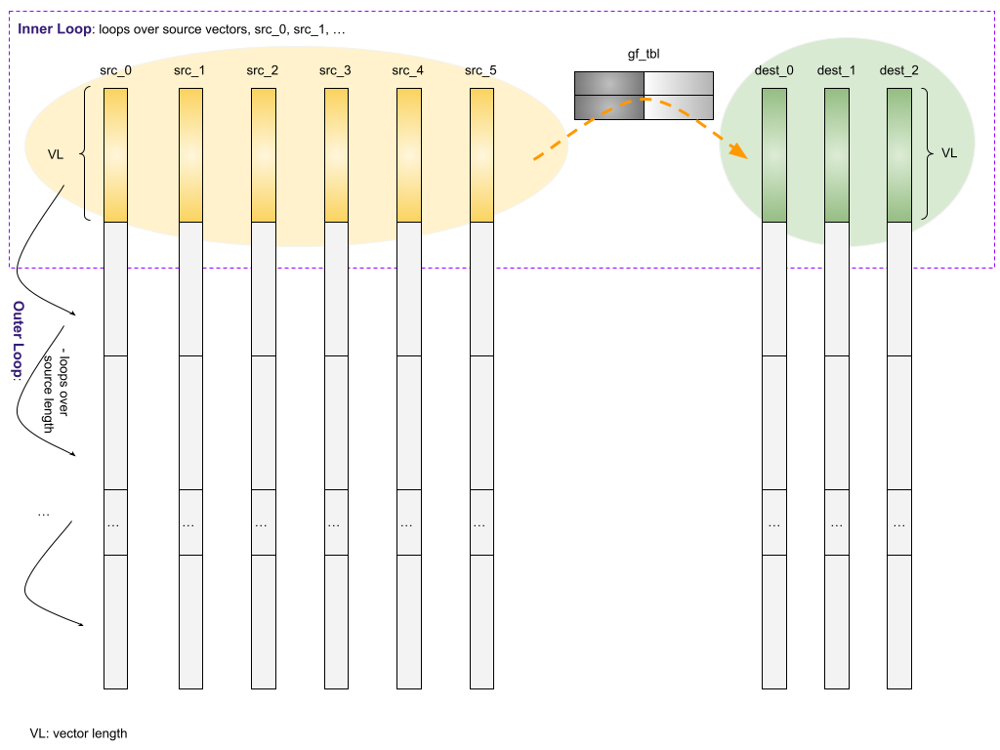

# Erasure Code Software Design

This document provides a reverse engineered software design document for the existing ISA-L erasure code (EC). Target audiences are engineers who want to understand the erasure code algorithm and contribute into ISA-L EC.

According to [readme.md](https://github.com/intel/isa-l), the type of erasure code supported by ISA-L is “a fast block Reed-Solomon type EC for any encode/decode matrix in GF(2^8)”. GF is short for [Galois field](https://en.wikipedia.org/wiki/Finite_field).

## 1.1 Introduction of Erasure Code
Erasure code (EC) gets its name from the fact that it can recover the original message from several bit erasures (rather than bit errors). Erasure code transforms a message of *k* symbols into a longer message with *(k + m)* symbols, where it can tolerate a maximum of *m* symbols’ loss.

Erasure code is widely used in storage and communication fields. “The classical way to recover from failures in storage systems was to use replication. However, replication incurs significant overhead in terms of wasted bytes. Therefore, increasingly large storage systems, such as those used in data centers use erasure-coded storage. The most common form of erasure coding used in storage systems is Reed-Solomon (RS) code, an advanced mathematics formula used to enable regeneration of missing data from pieces of known data, called **parity blocks**.

Example: In RS(10,4) code, which is used in Facebook for their HDFS, 10 MB of user data is divided into ten 1MB blocks. Then, four additional 1MB parity blocks are created to provide redundancy. This can tolerate up to 4 concurrent failures. The storage overhead here is 14/10 = 1.4X.” - Ref: [wikipedia: Erasure_code](https://en.wikipedia.org/wiki/Erasure_code)

Before moving on, let's define some mnemonics. Taking the example above RS(10,4), RS is called **‘codec’**, 10 is the number of **‘data blocks’**, 4 is the number of **‘parity blocks’**, and 1MB is **‘cell size’**. “The sum of the number of data blocks and parity blocks is the **‘data-stripe width’**. When you make hardware plans for your cluster, the number of racks should at least equal the stripe width in order for the data to be resistant to rack failures.” - Ref: [Cloudera: HDFS data durability](https://docs.cloudera.com/documentation/enterprise/latest/topics/admin_hdfs_datadurability.html#concept_b4w_mzm_5cb)

### 1.1.1 Encoding and Decoding
RS (k,m) encoding works by a matrix-matrix multiplication of data blocks and a Generator Matrix (GT). The result is ‘parity blocks’. As illustrated below, RS (4,2) - 4 ‘data blocks’, 2 ‘parity blocks’:

Ref: [https://www.usenix.org/legacy/event/fast09/tech/full_papers/plank/plank.pdf](https://www.usenix.org/legacy/event/fast09/tech/full_papers/plank/plank.pdf)

But please be noted that calculations in RS encoding/decoding are based on mathematics of Galois field (i.e. Finite field).
-   Multiplication of two elements in the Galois field - GF(2^8) is different from multiplication in arithmetic. In ISA-L EC, GF(2^8) multiplication is implemented with pre-computed look-up tables. (gf_tbl, more explanation comes below).
-   Addition of two elements in the Galois field - GF(2^8) equals bitwise ‘exclusive-or’ (XOR).

Ref: [wikipedia: Finite field](https://en.wikipedia.org/wiki/Finite_field) for more details.
 
RS (k,m) decoding (i.e. storage failures) can be done by the same matrix-matrix multiplication but with different inputs: the surviving blocks and the inverse of GT (rows in GT corresponding to failed units should be deleted before taking its inverse.)

### 1.1.2 Single Source Updating

In all storage systems, data updates are common. When source ‘data blocks’ are updated, ‘parity blocks’ also need to be updated for consistency. In EC, “instead of summing over all data blocks, we compute new parity blocks based on the change of data blocks.”

Ref: [https://www.usenix.org/system/files/conference/fast14/fast14-paper_chan.pdf](https://www.usenix.org/system/files/conference/fast14/fast14-paper_chan.pdf)

Here is the chart to visualize what to do for a single ‘data block’ update. Note d’2  is the difference between new and old data blocks.

## 1.2 ISA-L EC - Software Architecture

In this section, software architecture of ISA-L EC is explained in a reverse-engineering way. In general, EC ‘parity blocks’ computing can be split into two steps.

-   Step 1: Generate a pre-computed look-up table (i.e. `g_tbls` or `gf_tbl`).
-   Step 2: Encode / decode / update of `parity blocks`

Source files [erasure_code_test.c](https://github.com/intel/isa-l/blob/master/erasure_code/erasure_code_test.c) and [erasure_code_perf.c](https://github.com/intel/isa-l/blob/master/erasure_code/erasure_code_perf.c) are good resources to understand this computing flow.

### 1.2.1 Step 1

Step 1 takes in: number of ‘data blocks’, number of ‘paritiy blocks’, and RS codec types as input parameters, and generates: look-up table ‘g_tbls’ as output.

Step 1 is the preparation phase, and routines can be furtherly split into two categories.

Routines of Step 1 fall into two categories:

1.  gf(2^8) matrix generations. Depending on the type of codec, one of the routines below is called to generate a GT matrix.
    - gf_gen_rs_matrix ( )
    - gf_gen_cauchy1_matrix ( )[^1]
    - gf_gen_decode_matrix ( )
    - gf_invert_matrix ( )
2.  look-up table generation. The matrix generated above is used here to generate the look-up table (g_tbls).
    - ec_init_tables ( )

Implementation of these routines can be found in file [ec_base.c](https://github.com/intel/isa-l/blob/master/erasure_code/ec_base.c). As these routines are relatively small in code sizes and are one-time cost in the whole EC computing process, they are written in C and relying on compiler to do optimization.

[^1]: Cauchy Reed-Solomon codec, developed in the mid 1990’s by J. Blomer, M. Kalfane, M. Karpinski, R. Karp, M. Luby, and D. Zuckerman. An XOR-based erasure-resilient coding scheme. Technical Report TR-95-048, International Computer Science Institute, August 1995.

#### 1.2.1.1 ‘g_tbls’ Structure

One important output of Step 1 is the look-up table ‘g_tbls’. Each element in ‘g_tbls’ is 32-bytes long. The table is two-dimensional, with number of ‘parity blocks’ rows and number ‘data blocks’ columns.

Note: Mathematical analysis of this table is out of scope of this document. Audiences who are interested on that can refer to [this paper](https://citeseerx.ist.psu.edu/viewdoc/download?doi=10.1.1.219.3226&rep=rep1&type=pdf)[^2]

[^2]: GREENAN, K., MILLER, E., AND SCHWARTZ, T. J. Optimizing Galois Field arithmetic for diverse processor architectures and applications. In MASCOTS 2008: 16th IEEE Symposium on Modeling, Analysis and Simulation of Computer and Telecommunication Systems (Baltimore, MD, September 2008).

### 1.2.2 Step 2

Step 2 takes in: the look-up table (g_tbls) which is generated in the previous step, and the ‘data blocks’ as input parameters, and generates: ‘parity blocks’ as output.

Step 2 is the hot part, and so-called ‘kernels’ of EC.

Routines in Step 2 include:

-   ec_encode_data ( )
    - gf_ ? vect_dot_prod ( )
-   ec_encode_data_update ( )
    - gf_ ? vect_mad ( )
-   gf_vect_mul ( )

There are two categories of handwriting assembly routines: gf_?vect_dot_prod ( ) and gf_?vect_mad / \_mul ( ). Section 1.3 and 1.4 will cover the flow charts of them. Before that, there is one more problem to discuss: from an architectural independent user-facing public APIs, how they map into the low-level architectural specific assembly routines?

#### 1.2.2.1 Multiple Architecture Dispatch Flow Chart

Architectural independent user-facing public APIs are defined in file: [include/erasure_code.h](https://github.com/intel/isa-l/blob/master/include/erasure_code.h). In this table below, let’s traverse how it works on aarch64 platform as an example.

| Calling Path: | Defined in: |
| --- | --- |
| `ec_encode_data()` | include/[erasure_code.h](https://github.com/intel/isa-l/blob/master/include/erasure_code.h) |
| `mbin_interface ec_encode_data` | erasure_code/aarch64/[ec_multibinary_arm.S](https://github.com/intel/isa-l/blob/master/erasure_code/aarch64/ec_multibinary_arm.S), `mbin_interface` is defined in: include/[aarch64_multibinary.h](https://github.com/intel/isa-l/blob/master/include/aarch64_multibinary.h) |
| `ec_encode_data_dispatcher()` | erasure_code/aarch64/[ec_aarch64_dispatcher.c](https://github.com/intel/isa-l/blob/master/erasure_code/aarch64/ec_aarch64_dispatcher.c) |
| `ec_encode_data_sve()` | erasure_code/aarch64/[ec_aarch64_highlevel_func.c](https://github.com/intel/isa-l/blob/master/erasure_code/aarch64/ec_aarch64_highlevel_func.c) |
| `gf_?vect_dot_prod_sve()`, aarch64 architecture specific code | erasure_code/aarch64/[gf_?vect_dot_prod_sve.S](https://github.com/intel/isa-l/tree/master/erasure_code/aarch64) |

## 1.3 _dot_prod Flow Chart

As mentioned above, dot product is used in EC encoding and decoding, while mad is used in EC updating. In the following two sections, data flow of these two routines will be explained.

‘dot product’ takes in multiple source vectors (data blocks), multiplies with a look-up table (called g_tbls / gf_tbl), and finally generates multiple destination vectors (parity blocks).

‘dot product’ includes two loops. The outer loop covers the source vector length, and it traverses the whole vector length (i.e each source data block’s length) at a given stride. The inner loop covers all source vectors, and it generates the partial \_dot_product of destination vectors based on source and gf_tbl.

From the memory operation viewpoint, there are two read operations in each inner loop.

1.  gf_tbl
2.  src vector

There is no memory write operation in the inner loop. Memory write happens after the inner loop as part of the outer loop.

1.  dest vector

Here is a high-level chart about gf_?vect_dot_product. Taking RS(6,3) as an example. Meaning there are 6 source vectors and 3 destination vectors:

Here is a closer look of what gf_vect_dot_prod_sve() does.

### 1.3.1 gf_tbl is explained.

Here is an explanation of gf_tbl (i.e g_tbls)

Secondly, how is ‘gf_tbl’ used to transform a ‘source byte’ to a ‘dest byte’?

## 1.4 _mad / _mul Flow Chart

‘mad’ is a short for ‘multiply and add’. In EC’s linguist, multiply is a single source vector ‘multiplied’ with gf_tbl. Add is to add the multiplication results back (exclusive or) to the original destination vectors.

‘mad’ is used to update destination vectors when a single source vector is changed.

From the memory operations viewpoint, there are three read operations in each ‘mad’ loop.

1.  dest vector
2.  gf_tbl
3.  src vector

There is one memory write operation in each ‘mad’ loop.

1.  dest vector

A high-level chart about gf multiple dest vectors _mad:

-   Taking RS(6,3) as an example
-   Memory reads: dest, src, and gf_tbl
-   Memory writes: dest

